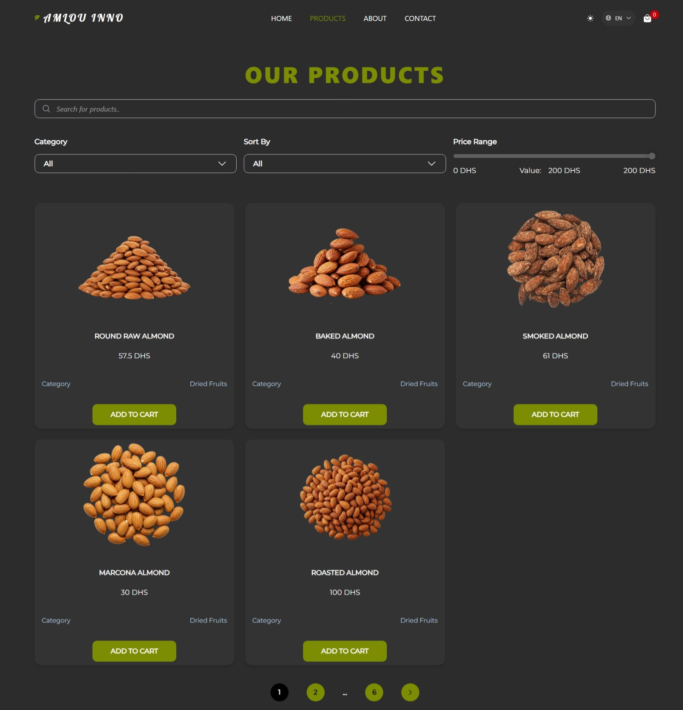
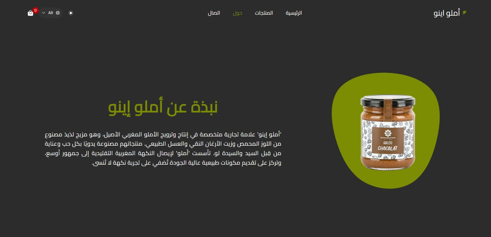

# 🛍️ Amlou Ecommerce Website

**Amlou Ecommerce** هو موقع تجارة إلكترونية بسيط وعصري مبني باستخدام ReactJS وVite، متخصص في عرض وبيع منتجات طبيعية محلية. الموقع يضم فئات متنوعة مثل:

أملو

العسل

المكسرات

منتجات العناية الطبيعية

يهدف الموقع لتقديم تجربة تسوق سهلة وسريعة الاستجابة مع تصميم أنيق يبرز جودة المنتجات الطبيعية الأصيلة.
## 🔗 رابط المعاينة

[🌐 شاهد الموقع مباشرة](https://amlou-ecommerce-website.vercel.app/) 

---

## 📸 صور من المشروع






---

## 🧰 التقنيات والمكتبات المستعملة

- ⚛️ **React 18** – لبناء واجهة المستخدم
- 🚀 **Vite** – لتطوير سريع وتجميع خفيف
- 🎨 **Tailwind CSS 4** – لتصميم عصري وسريع
- 🔄 **React Router v7** – للتنقل بين الصفحات
- 🌐 **Axios** – للتواصل مع APIs
- 🌍 **i18next + react-i18next** – لتعدد اللغات (i18n)
- 🧠 **Framer Motion** – للأنيميشن والانتقالات
- 🎭 **React Icons** – لأيقونات جاهزة
- 🧪 **React Helmet Async** – للتحكم في الـ head (SEO)
- ⏳ **React Loading Skeleton** – للتحميل الوهمي (skeletons)
- 🌀 **SwiperJS** – للسلايدر والكاروسيل
- 🎛️ **React Spinners** – لـ loaders متحركة
- 🧪 **ESLint** – لضبط جودة الكود
- 📦 **vite-plugin-compression** – لضغط الملفات النهائية وتحسين الأداء


```
amlouEcommerce-website
├─ eslint.config.js
├─ index.html
├─ package-lock.json
├─ package.json
├─ public
│  ├─ assets
│  │  ├─ bg-new.jpg
│  │  └─ productsImg
│  │     ├─ amande-crue-rond.png
│  │     ├─ amande-forna.png
│  │     ├─ amande-fumée.png
│  │     ├─ amande-marcona.png
│  │     ├─ amande-roussi.png
│  │     ├─ amandes-effilées.png
│  │     ├─ amandes-hachées.png
│  │     ├─ amandes-romarin.png
│  │     ├─ amandes-salées.png
│  │     ├─ amlou-cacahuetes-et-fleur-de-sel.png
│  │     ├─ amlou-chocolat-noir.png
│  │     ├─ amlou-light.png
│  │     ├─ amlou-noix-de-cajou-dattes.png
│  │     ├─ amlou-orange-chocolat.png
│  │     ├─ amlou-pistache.png
│  │     ├─ amlouAmandes.png
│  │     ├─ cajou-caramélisées.png
│  │     ├─ cajou-chili.png
│  │     ├─ cajou-fromage.png
│  │     ├─ cajou-salée.png
│  │     ├─ cashew-nuts.png
│  │     ├─ noix-de-cajou-au-romarin.png
│  │     ├─ noix-de-cajou-citron.png
│  │     ├─ noix-de-cajou-truffe-bio.png
│  │     ├─ noix-de-cajou.png
│  │     ├─ shelled-almonds.png
│  │     └─ sicilian-shelled-almonds.png
│  ├─ data
│  │  └─ products.json
│  └─ robots.txt
├─ README.md
├─ src
│  ├─ App.jsx
│  ├─ assets
│  │  ├─ almonds.png
│  │  ├─ amandes1.webp
│  │  ├─ amlouBloz.svg
│  │  ├─ amlouKawkaw.png
│  │  ├─ cajou1.webp
│  │  ├─ cashew.png
│  │  ├─ cashews.png
│  │  ├─ img1
│  │  │  ├─ img1.webp
│  │  │  ├─ img1_w_1268.webp
│  │  │  ├─ img1_w_200.webp
│  │  │  ├─ img1_w_2000.webp
│  │  │  ├─ img1_w_882.webp
│  │  │  └─ shape.webp
│  │  ├─ loz.png
│  │  ├─ pistach.png
│  │  ├─ pistach1.png
│  │  ├─ pistachios.png
│  │  └─ testimonials
│  │     ├─ bg.jpg
│  │     ├─ men-1.jpg
│  │     ├─ men-2.jpg
│  │     ├─ men-3.jpg
│  │     ├─ women-1.jpg
│  │     ├─ women-2.jpg
│  │     └─ women-3.jpg
│  ├─ components
│  │  ├─ Home
│  │  │  ├─ DiscoverCards.jsx
│  │  │  ├─ FeaturedProducts.jsx
│  │  │  ├─ HeroSection.jsx
│  │  │  ├─ News.jsx
│  │  │  ├─ ResponsiveImage.jsx
│  │  │  ├─ Testimonials.jsx
│  │  │  ├─ TestimonialsCarousel.jsx
│  │  │  ├─ WhyChooseUs.jsx
│  │  │  └─ WrapperResponsiveImage.jsx
│  │  ├─ sections
│  │  │  ├─ About
│  │  │  │  ├─ ContentAbout.jsx
│  │  │  │  ├─ Slider.css
│  │  │  │  └─ Slider.jsx
│  │  │  ├─ Contact
│  │  │  │  ├─ ContactForm.jsx
│  │  │  │  └─ ContactInfo.jsx
│  │  │  ├─ Footer.jsx
│  │  │  ├─ Header.jsx
│  │  │  ├─ MainWrapper.jsx
│  │  │  ├─ Products
│  │  │  │  ├─ Card.jsx
│  │  │  │  ├─ CardsProducts.jsx
│  │  │  │  ├─ DropDown.jsx
│  │  │  │  ├─ FilterBar.jsx
│  │  │  │  ├─ Pagination.jsx
│  │  │  │  ├─ PriceRange.jsx
│  │  │  │  ├─ SearchInput.jsx
│  │  │  │  └─ SkeletonLoader.jsx
│  │  │  ├─ ProtectedRoute.jsx
│  │  │  └─ ShoppingCart.jsx
│  │  └─ ui
│  │     ├─ MetaTag.jsx
│  │     └─ SwitcherLang.jsx
│  ├─ features
│  │  ├─ auth
│  │  │  ├─ authApi.js
│  │  │  ├─ authSlice.js
│  │  │  └─ authThunk.js
│  │  ├─ cart
│  │  │  └─ cartSlice.js
│  │  └─ products
│  │     └─ productsSlice.js
│  ├─ fonts
│  │  ├─ Lobster.ttf
│  │  ├─ Montserrat.ttf
│  │  ├─ Poppins.ttf
│  │  └─ Xander.ttf
│  ├─ hooks
│  │  ├─ useDarkMode.jsx
│  │  ├─ useDebounced.jsx
│  │  ├─ useFetchProducts.jsx
│  │  ├─ useFilters.js
│  │  └─ useIsArabic.jsx
│  ├─ i18n.js
│  ├─ index.css
│  ├─ locales
│  │  ├─ ar
│  │  │  └─ translation.json
│  │  ├─ en
│  │  │  └─ translation.json
│  │  ├─ fr
│  │  │  └─ translation.json
│  │  └─ index.js
│  ├─ main.jsx
│  ├─ pages
│  │  ├─ About.jsx
│  │  ├─ auth
│  │  │  ├─ Login.jsx
│  │  │  └─ Register.jsx
│  │  ├─ Contact.jsx
│  │  ├─ dashboard
│  │  │  ├─ admin
│  │  │  │  ├─ AddProduct.jsx
│  │  │  │  ├─ AdminUsers.jsx
│  │  │  │  ├─ index.jsx
│  │  │  │  └─ Orders.jsx
│  │  │  └─ user
│  │  │     ├─ index.jsx
│  │  │     └─ Orders.jsx
│  │  ├─ Home.jsx
│  │  ├─ NotFound.jsx
│  │  ├─ Products.jsx
│  │  ├─ Unauthorized.jsx
│  │  └─ VerifyEmail.jsx
│  ├─ routes
│  │  └─ MainRoutes.jsx
│  ├─ store
│  │  ├─ middleware
│  │  │  └─ cartMiddleware.js
│  │  └─ store.js
│  └─ utils
│     ├─ axios.js
│     ├─ filtredProducts.js
│     └─ validators.js
├─ tailwind.config.js
├─ vercel.json
└─ vite.config.js

```